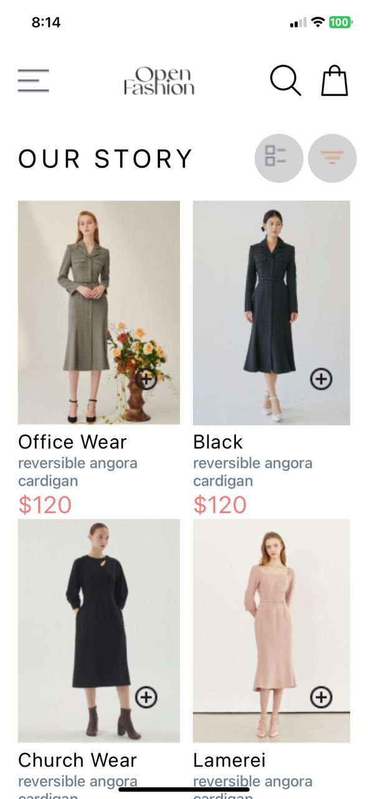
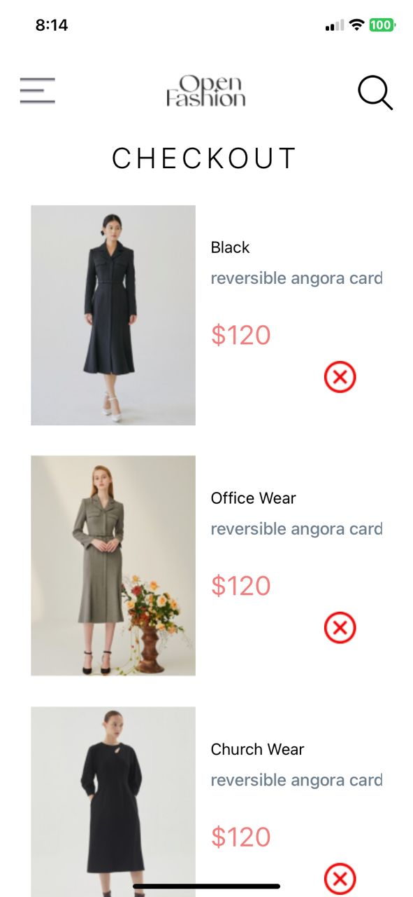

# React Native Shopping Cart App

## Overview

This application is a simple shopping cart app built using React Native. It allows users to view a list of available products, add products to their cart, remove products from their cart, and view the items in their cart. The cart state is saved locally on the device using `AsyncStorage`.

## Features

- **HomeScreen**: Displays a list of available products.
- **CartScreen**: Displays the items added to the cart.
- **Add to Cart**: Allows users to add products to their cart.
- **Remove from Cart**: Allows users to remove products from their cart.
- **Persistent Cart**: The cart state is saved locally using `AsyncStorage` and is persistent across app sessions.

## Design Choices

### State Management

- **useContext**: The app uses React's `useContext` to manage the global state of the cart. This allows for easy access and updates to the cart state from any component within the app.

### Local Storage

- **AsyncStorage**: The app uses `AsyncStorage` to persist the cart

## Screenshots of the App

